[技术陷阱网站](https://lur3guge.pinit.eth.limo/)

## 一、核心论点总结：技术进步的双刃剑

卡尔·贝内迪克特·弗雷（Carl Benedikt Frey）在《技术陷阱》中构建了一个跨越三个世纪的技术-经济-社会分析框架，核心论点可归纳为：**技术进步并不会带来线性的福祉增长，而是周期性地在"赋能"与"取代"之间摆动，其社会后果取决于分配机制与制度响应速度**。

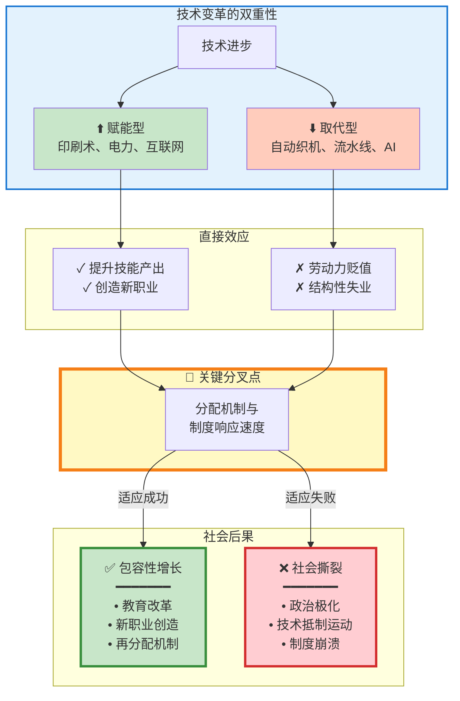
```mermaid
graph TB
    subgraph tech["技术变革的双重性"]
        T[技术进步]
        T --> T1["⬆️ 赋能型<br/>印刷术、电力、互联网"]
        T --> T2["⬇️ 取代型<br/>自动织机、流水线、AI"]
    end
    
    subgraph effects["直接效应"]
        E1["✓ 提升技能产出<br/>✓ 创造新职业"]
        E2["✗ 劳动力贬值<br/>✗ 结构性失业"]
    end
    
    subgraph fork["🔀 关键分叉点"]
        F["分配机制与<br/>制度响应速度"]
    end
    
    subgraph outcomes["社会后果"]
        direction LR
        O1["✅ 包容性增长<br/>━━━━━━━<br/>• 教育改革<br/>• 新职业创造<br/>• 再分配机制"]
        O2["❌ 社会撕裂<br/>━━━━━━━<br/>• 政治极化<br/>• 技术抵制运动<br/>• 制度崩溃"]
    end
    
    T1 --> E1
    T2 --> E2
    E1 --> F
    E2 --> F
    
    F -->|适应成功| O1
    F -->|适应失败| O2
    
    style tech fill:#e3f2fd,stroke:#1976d2,stroke-width:2px
    style T1 fill:#c8e6c9
    style T2 fill:#ffccbc
    style fork fill:#fff9c4,stroke:#f57f17,stroke-width:4px
    style O1 fill:#c8e6c9,stroke:#388e3c,stroke-width:3px
    style O2 fill:#ffcdd2,stroke:#d32f2f,stroke-width:3px

```

### 1.1 分析框架：技术-制度-社会三角互动模型

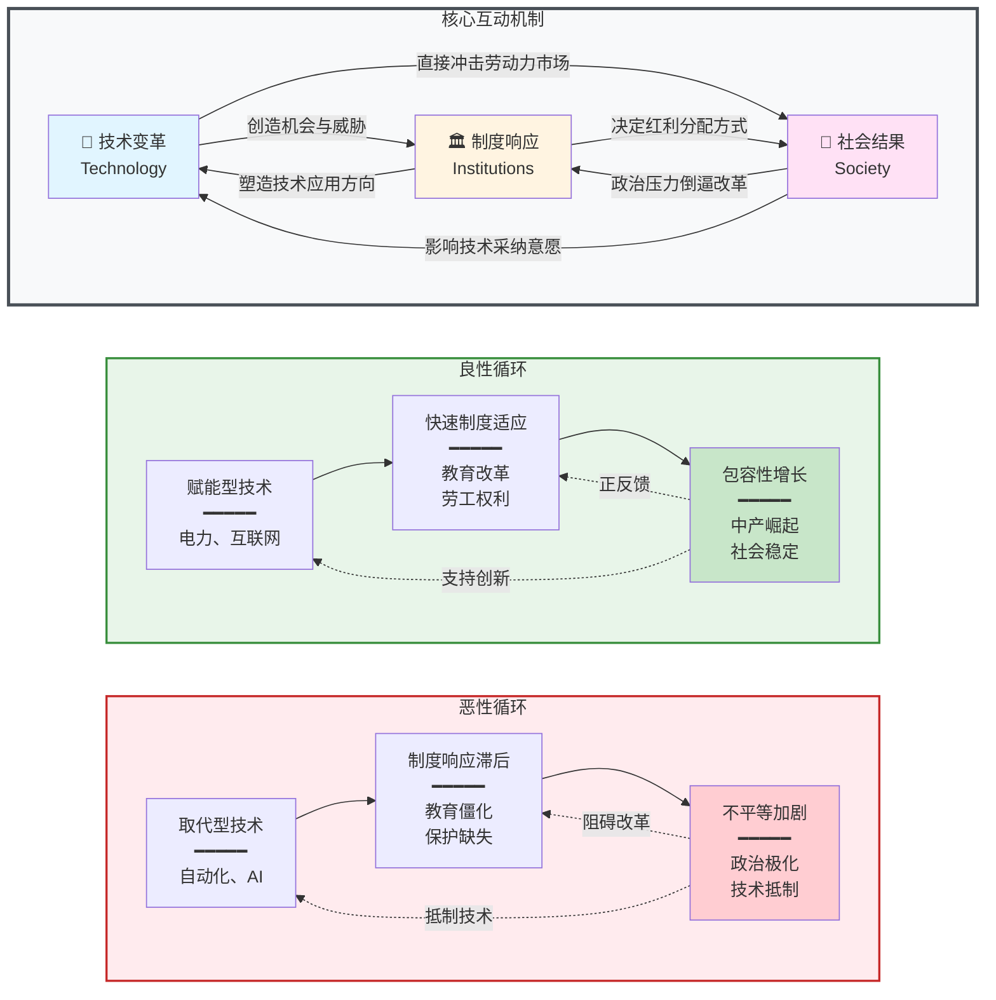
```mermaid
graph TB
    subgraph core["核心互动机制"]
        T["🔧 技术变革<br/>Technology"]
        I["🏛️ 制度响应<br/>Institutions"]
        S["👥 社会结果<br/>Society"]
        
        T -->|创造机会与威胁| I
        T -->|直接冲击劳动力市场| S
        
        I -->|塑造技术应用方向| T
        I -->|决定红利分配方式| S
        
        S -->|政治压力倒逼改革| I
        S -->|影响技术采纳意愿| T
    end
    
    core ~~~ virtuous
    
    subgraph virtuous["良性循环"]
        T1["赋能型技术<br/>━━━━━<br/>电力、互联网"] 
        I1["快速制度适应<br/>━━━━━<br/>教育改革<br/>劳工权利"]
        S1["包容性增长<br/>━━━━━<br/>中产崛起<br/>社会稳定"]
        
        T1 --> I1 --> S1
        S1 -.正反馈.-> I1
        S1 -.支持创新.-> T1
    end
    
    virtuous ~~~ vicious
    
    subgraph vicious["恶性循环"]
        T2["取代型技术<br/>━━━━━<br/>自动化、AI"]
        I2["制度响应滞后<br/>━━━━━<br/>教育僵化<br/>保护缺失"]
        S2["不平等加剧<br/>━━━━━<br/>政治极化<br/>技术抵制"]
        
        T2 --> I2 --> S2
        S2 -.阻碍改革.-> I2
        S2 -.抵制技术.-> T2
    end
    
    style core fill:#f8f9fa,stroke:#495057,stroke-width:3px
    style virtuous fill:#e8f5e9,stroke:#388e3c,stroke-width:2px
    style vicious fill:#ffebee,stroke:#c62828,stroke-width:2px
    style T fill:#e1f5ff
    style I fill:#fff4e1
    style S fill:#ffe1f5
    style S1 fill:#c8e6c9
    style S2 fill:#ffcdd2
```

**核心机制：**
1. **技术→制度**：技术变革创造新的机会与挑战，倒逼制度响应（教育、劳动法、税制）。
2. **制度→社会**：制度质量决定技术红利是共享还是集中。
3. **社会→技术**：社会结果反过来影响技术扩散与采纳意愿。
4. **分叉变量**：制度响应速度与质量决定社会是进入良性循环还是恶性循环。
5. **两类陷阱**：要么因维稳而压制创新（停滞陷阱），要么因分配失衡导致撕裂（不平等陷阱）。
6. **滞后循环**：技术先改造生产，社会压力再推动政治博弈，最终倒逼制度改革；滞后期越长，代价越高。

---

## 二、历史镜像：工业革命的残酷教训

### 2.1 第一次工业革命：取代型技术的漫长阵痛（1760-1850）

#### 核心定性：取代型革命

第一次工业革命的本质是**用机器取代人的体力劳动**：

- **纺纱机**取代了纺织工人的手。
- **蒸汽机**取代了人力、畜力、水力来驱动机器和交通工具（火车、轮船）。
- **工厂模式**，本质上是将分散的、低效的手工作坊劳动，用集中的、高效的机器劳动来取代。

它的革命性在于首次实现了对人类体力的规模化、机械化超越，但其主要应用领域，如纺织、采矿、运输，都是人类社会早已存在的经济活动。它让这些活动变得前所未有地高效，但并未创造出全新的生活方式或产业门类。

**残酷性的根源**：当技术的主要作用是"做同样的事但更便宜"时，原有劳动力直接成为被淘汰对象，而非被赋能的对象。机器与工人是**零和博弈**关系。

#### "恩格斯停滞"现象

Frey在书中详细分析了英国工业革命期间长达近一个世纪的"**恩格斯停滞**"现象——尽管GDP增长显著，但工人实际工资几乎停滞，生活水平甚至下降。

**这并非因为技术进步必然带来痛苦，而是因为当时的政治权力首次掌握在了能从机械化中受益的实业家手中，他们有能力推动符合自身利益的变革，而社会制度的调整却远远滞后。**

#### 卢德运动

"卢德派"（Luddites）如今常被用作贬义词，形容非理性地恐惧技术的人。但弗雷指出，从他们切身的、代际的经历来看，他们的反抗是完全理性的。当机械化织机摧毁了他们赖以为生的技能时，他们选择了砸毁机器作为回应，英国政府派出了12,000人的军队进行镇压——这支部队的规模甚至超过了同时期威灵顿公爵在半岛战争中与拿破仑作战的远征军。

**数据支撑**：

- 1770-1840年间，英国手工织工实际工资下降约40-50%
- 1820年代，一台动力织机可取代4-6名熟练织工
- 卢德运动期间，超过1000台机器被摧毁，政府部署军队镇压

#### 深层机制

1. **技能贬值速度** > **新技能习得速度**：手工织工的20年学徒经验在3年内变得毫无价值
2. **资本积累集中化**：机器成本高昂，财富向工厂主集中
3. **制度真空期**：工会非法（1799年《结社法》），社会保障缺失，教育体系未改革
4. **权力结构的锁定效应**：
    - 工业资本家首次掌握政治话语权（1832年改革法案扩大选举权，但仍排斥工人阶级）
    - 他们有动机维持低工资、长工时的"血汗工厂"模式
    - 反对力量（工人）被系统性压制：工会非法、集会被禁、卢德分子被绞刑
    - **关键数据**：1812年，英国议会通过法案，将捣毁机器定为死罪，17人被处决

**对比**：第二次革命时，工人阶级已通过宪章运动等斗争获得了部分政治权利（1867/1884年选举权扩大），能够通过制度内渠道施压，加速了劳工保护立法。

#### 技术创新的"工匠模式"

- 珍妮纺纱机的发明者哈格里夫斯是木匠
- 瓦特改良蒸汽机依赖的是仪器制造经验，而非热力学理论
- **后果**：技术进步依赖个人天才和偶然性，难以系统化培养，导致劳动力转型缺乏教育支撑

> *卢德分子并非盲目的技术恐惧者，而是理性的经济行动者。当制度无法提供转型路径时，破坏机器成为唯一的议价手段。
> 技术红利的分配存在**时间滞后效应**——从技术突破到社会普遍受益，往往需要2-3代人的时间。这个滞后期充满了社会动荡、政治冲突和人道主义灾难。*

### 2.2 第二次工业革命：赋能型技术的黄金时代（1870-1920）

#### 核心定性：赋能型革命

第二次工业革命不仅意味着旧技术被取代，更**创造了全新的可能性**：

- **电力**：它不只是对蒸汽机动力的取代。它带来了**即时、可控、可传输**的能源，赋能了夜晚（电灯），赋能了即时通讯（电话、电报），赋能了家庭（家用电器），赋能了城市（电车），构建了一个全新的“电力社会网络”。这是蒸汽机无法做到的。
- **内燃机和汽车**：它不只是“更快的马车”。它赋予了普通人**前所未有的个人机动性**，彻底改变了城市的空间布局（郊区化）、人们的生活半径和时间观念。
- **化学工业**：它赋予了人类**创造新物质**的能力，从化肥、塑料到药品，这些都不是对自然界原有事物的简单取代，而是全新的创造。

第二次工业革命的技术，系统性地创造了现代生活的基础设施和框架，从通信网络、电力网络到交通网络，它们赋予了整个社会一种全新的运行模式。

**繁荣的根源**：技术创造了**增量市场**和**新职业类别**，劳动力不是被取代，而是被吸纳到新兴产业中。机器与工人是**协同关系**。

#### 三大技术革命的赋能效应

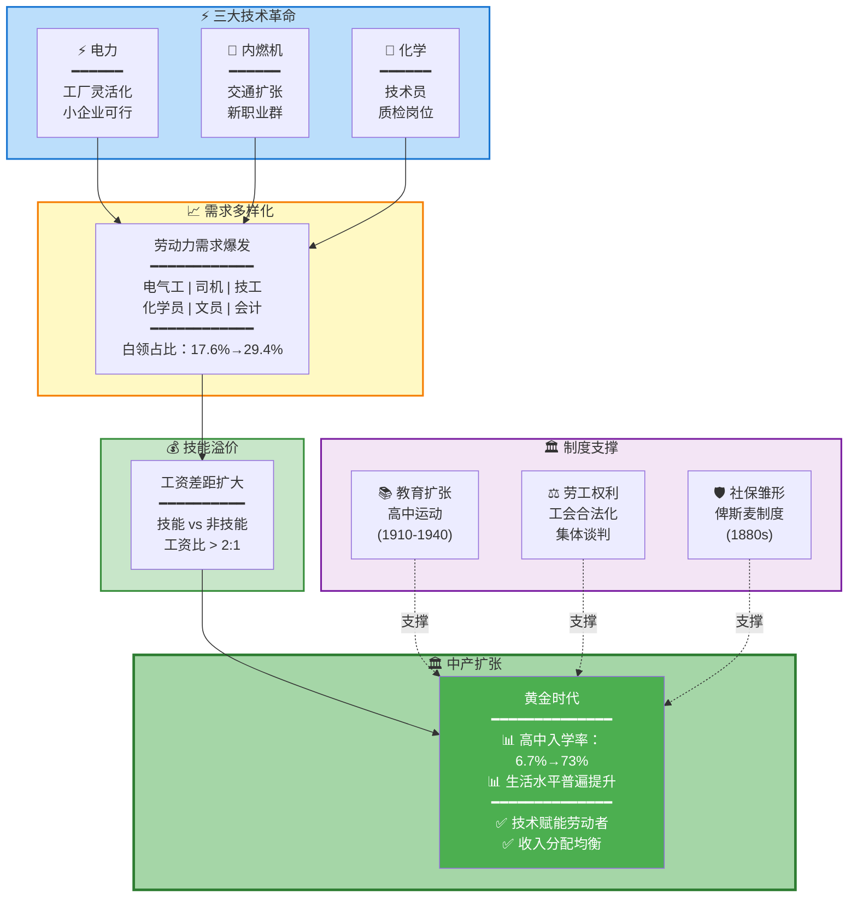
```mermaid
graph TB
    subgraph tech["⚡ 三大技术革命"]
        T1["⚡ 电力<br/>━━━━━━<br/>工厂灵活化<br/>小企业可行"]
        T2["🚗 内燃机<br/>━━━━━━<br/>交通扩张<br/>新职业群"]
        T3["🧪 化学<br/>━━━━━━<br/>技术员<br/>质检岗位"]
    end
    
    subgraph demand["📈 需求多样化"]
        D["劳动力需求爆发<br/>━━━━━━━━━━━━<br/>电气工 | 司机 | 技工<br/>化学员 | 文员 | 会计<br/>━━━━━━━━━━━━<br/>白领占比：17.6%→29.4%"]
    end
    
    subgraph premium["💰 技能溢价"]
        P["工资差距扩大<br/>━━━━━━━━━━<br/>技能 vs 非技能<br/>工资比 > 2:1"]
    end
    
    subgraph expansion["🏛️ 中产扩张"]
        E["黄金时代<br/>━━━━━━━━━━━━━━<br/>📊 高中入学率：6.7%→73%<br/>📊 生活水平普遍提升<br/>━━━━━━━━━━━━━━<br/>✅ 技术赋能劳动者<br/>✅ 收入分配均衡"]
    end
    
    subgraph institution["🏛️ 制度支撑"]
        I1["📚 教育扩张<br/>高中运动<br/>(1910-1940)"]
        I2["⚖️ 劳工权利<br/>工会合法化<br/>集体谈判"]
        I3["🛡️ 社保雏形<br/>俾斯麦制度<br/>(1880s)"]
    end
    
    T1 --> D
    T2 --> D
    T3 --> D
    D --> P
    P --> E
    
    I1 -.支撑.-> E
    I2 -.支撑.-> E
    I3 -.支撑.-> E
    
    style tech fill:#bbdefb,stroke:#1976d2,stroke-width:2px
    style demand fill:#fff9c4,stroke:#f57c00,stroke-width:2px
    style premium fill:#c8e6c9,stroke:#388e3c,stroke-width:2px
    style expansion fill:#a5d6a7,stroke:#2e7d32,stroke-width:3px
    style institution fill:#f3e5f5,stroke:#7b1fa2,stroke-width:2px
    style E fill:#4caf50,color:#fff

```

**关键数据**：

- 1890-1940年，美国高中入学率从6.7%上升至73%
- 技能工人与非技能工人工资差距扩大至2:1以上
- 1900-1930年，白领职业占比从17.6%增至29.4%

#### 技术创新的"实验室模式"

- 爱迪生的门洛帕克实验室（1876）：工业研发的雏形
- 德国化学工业的崛起：基于李比希的有机化学理论
- **后果**：企业设立研发部门，大学培养工程师，形成"科学→技术→产业"的良性循环，为劳动力转型提供了教育基础设施

**数据支撑**：

- 1900年，美国仅有约100个工业实验室
- 1940年，这一数字超过2,200个
- 同期，工程学位授予数从每年不足1,000增至超过16,000

#### 制度创新的同步响应

1. **公共教育扩张**：美国"高中运动"（1910-1940）培养了大量技术工人
2. **劳工权利确立**：工会合法化，集体谈判权
3. **社会保障雏形**：德国俾斯麦的社会保险制度（1880s）

#### 地理扩散与制度竞争

第二次工业革命的一个关键特征是**多国并行**：

- 美国：电力和汽车工业
- 德国：化学和电气工业
- 日本：明治维新后的快速工业化

**制度创新的加速机制**：

1. **横向学习**：德国的社会保险制度（1880s）被其他国家快速借鉴
2. **竞争压力**：各国为吸引技术人才，竞相改善劳工条件和教育体系
3. **国际劳工组织**：1919年成立，推动劳工标准的全球协调

**对比**：第一次革命时，英国作为唯一工业国，缺乏外部压力和参照系，制度改革完全依赖内部阶级斗争的漫长博弈。

### 2.3 两次革命的核心教训与AI时代启示

#### 两次革命的系统对比

| 维度     | 第一次工业革命               | 第二次工业革命                   |
| ------ | --------------------- | ------------------------- |
| 技术特性   | 取代型（机械化）              | 赋能型（电气化）                  |
| 技能溢价   | 下降（手工织工工资↓40-50%）     | 上升（技能/非技能工资比>2:1）         |
| 科技关系   | 工匠经验主导，科学理论缺失         | 科学理论指导，工业实验室兴起            |
| 新职业创造  | 有限（主要是工厂工人）           | 爆发式（电气工、司机、化学技师、白领等）      |
| 制度响应速度 | 滞后 50-70 年              | 同步或提前（20-30 年）             |
| 教育体系改革 | 1870 年《初等教育法》（革命后 110 年） | 1910 年代"高中运动"（革命后 40 年）      |
| 劳工权利确立 | 1871 年工会合法化（革命后 111 年）   | 1935 年《瓦格纳法》（革命后 65 年，但基础更早） |
| 地理特征   | 单中心（英国垄断）             | 多中心（美德日并行）                |
| 社会后果   | 卢德运动、宪章运动、恩格斯停滞       | 中产阶级崛起、技能溢价时代             |
| 受益时间差  | 2-3 代人（60-90 年）         | 1-1.5 代人（30-45 年）           |

#### 三条教训

1. **技术属性决定痛感强度**：取代型技术更易制造零和冲突，赋能型技术更易产生转型缓冲。  
2. **制度时滞决定社会代价**：第一次革命约 110 年滞后，第二次约 40 年滞后，时滞越长，代价越高。  
3. **权力结构决定红利去向**：政治话语权越集中，技术红利越易向资本单边聚集。  

---

### 2.4 第三次工业革命（1980-至 2023）：计算机化与劳动力市场分化

#### 核心定性：认知自动化革命 (Cognitive Automation)

与前两次革命主要针对**体力劳动的取代**不同，第三次工业革命的核心是**对脑力任务的选择性自动化**。其本质是 **常规任务偏向性技术变革**（Routine-Biased Technological Change, RBTC）：  
- 对中等技能岗位，主要是**取代效应**。  
- 对高技能岗位，主要是**赋能效应**。  

#### 核心机制：中等技能岗位空心化

1. **常规认知任务被软件取代**：簿记、录入、标准化文书处理。  
2. **常规体力任务被机器人取代**：装配、重复型机台操作。  
3. **非常规任务相对留存**：高端抽象分析被增强，低端服务劳动短期内仍难全面自动化。  

#### 阶段性结论（1980-2023）

- 劳动力结构从“橄榄型”转向“哑铃型”，中间层持续萎缩。  
- 数字平台的网络效应强化“赢家通吃”，收入分配进一步向头部集中。  
- 制度响应再次滞后：教育转型、劳工保护、再分配机制均未同步更新。  

生成式 AI 引发的新跃迁与“超级明星结构”见第 3 章。

#### 三次工业革命的全景对比

| 维度        | 第一次工业革命              | 第二次工业革命             | 第三次工业革命 (计算机化)           |
| --------- | -------------------- | ------------------- | ------------------------ |
| **核心定性**  | **取代型 (体力)**         | **赋能型 (体力+创造)**     | **选择性认知自动化 (取代+赋能)**     |
| **技术特性**  | 机械化 (取代肌肉)           | 电气化 (赋能社会)          | 数字化 (取代常规认知)             |
| **冲击对象**  | 手工艺人 (技能贬值)          | -                   | 中等技能白领和蓝领 (岗位消失)         |
| **受益群体**  | 资本家                  | 技术工人和新中产            | 高技能知识工作者 (赢家通吃)          |
| **社会结构**  | **无产阶级化** (工人与资本家对立) | **中产阶级化** (橄榄型社会形成) | **极化/分流** (哑铃型社会形成)      |
| **科技关系**  | 工匠经验主导               | 科学理论驱动 (实验室)        | 科学、技术、商业高度融合 (硅谷模式)      |
| **制度响应**  | **严重滞后 (100+年)**     | **基本同步 (30-40年)**   | **再次滞后 (40+年且仍在持续)**     |
| **关键制度**  | *缺失*：工会非法、无社保、无公立教育  | *建立*：公立高中、工会合法、社保雏形 | *失效/不足*：教育转型慢、工会衰落、再分配不足 |
| **社会后果**  | 卢德运动、宪章运动、恩格斯停滞      | 中产崛起、技能溢价黄金时代       | 民粹主义兴起、身份政治、中产焦虑         |
| **受益时间差** | 2-3代人 (60-90年)       | 1-1.5代人 (30-45年)    | 仍在扩大中...                 |

---

## 三、当代困境：人工智能时代的加速陷阱
### 3.1 范式突破：从“常规任务偏向”到“通用认知任务取代”

**核心定性转变**：Frey 等学者在 2018 年前建立的 AI 分析框架（基于机器学习）已失效。以 GPT-4 为代表的生成式 AI 不再仅仅是“工具”，而是**通用目的认知技术 (General-Purpose Cognitive Technology)**，其冲击范式已发生根本改变。

| 维度       | 旧 AI 范式 (机器学习, pre-2022)    | 新 AI 范式 (生成式 AI, post-2022)           |
| -------- | --------------------------- | ------------------------------------- |
| **核心能力** | 模式识别、分类、预测                  | 理解、生成、推理、交互                           |
| **冲击逻辑** | **常规任务偏向 (Routine-Biased)** | **技能偏向失效 (Skill-Biased Irrelevance)** |
| **主要影响** | 自动化**已知流程**                 | 自动化**认知本身**                           |
| **人机关系** | 人类训练、AI 执行                  | AI 成为认知能力的**普惠基础设施**                  |

**关键机制：认知能力的量产**

生成式 AI 的革命性在于它**大幅降低了获得和执行中高级认知技能的成本**。过去需要数年专业训练才能掌握的能力（如编程、法律分析、设计），现在可以通过自然语言交互瞬间获得。这导致：

1. **“入门级”认知工作被蒸发**：职业阶梯的第一级台阶被抽掉，因为 AI 可以完成大部分初级专业人士的工作。
2. **“经验”的价值被重估**：许多基于重复性脑力劳动的“经验”被 AI 轻易复制，只有顶层的战略、创造和整合能力才有溢价。
3. **高技能工作不再安全**：这是历史上首次，技术的主要冲击波直接对准了受过高等教育的知识工作者阶层。

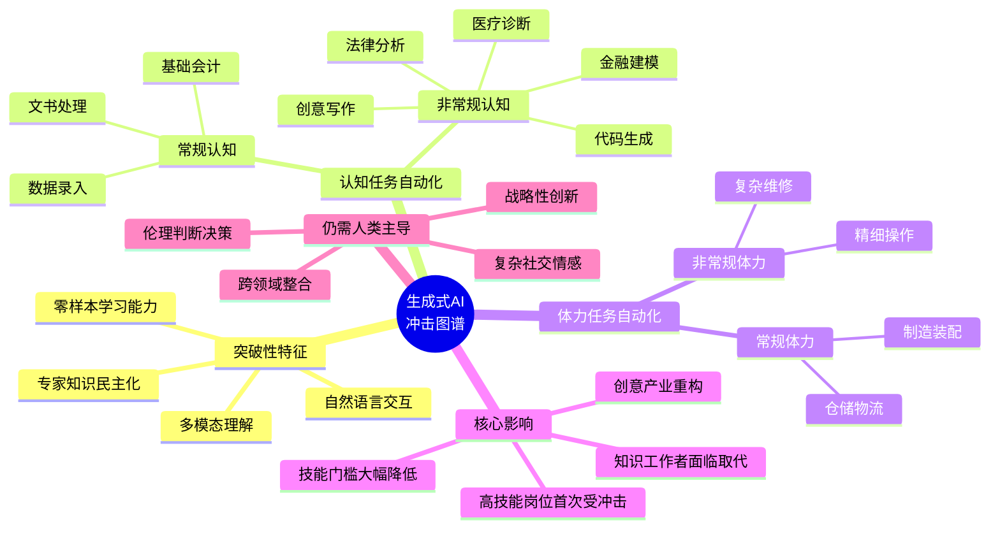
```mermaid
mindmap
  root((生成式AI<br/>冲击图谱))
    突破性特征
      自然语言交互
      零样本学习能力
      多模态理解
      专家知识民主化
    
    认知任务自动化
      常规认知
        数据录入
        文书处理
        基础会计
      非常规认知
        代码生成
        法律分析
        医疗诊断
        金融建模
        创意写作
    
    体力任务自动化
      常规体力
        仓储物流
        制造装配
      非常规体力
        精细操作
        复杂维修
    
    核心影响
      技能门槛大幅降低
      高技能岗位首次受冲击
      知识工作者面临取代
      创意产业重构
    
    仍需人类主导
      复杂社交情感
      伦理判断决策
      战略性创新
      跨领域整合

```

### 3.2 劳动力市场重构：从“极化”到“超级明星结构”

第三次工业革命的“哑铃型”社会结构正在被一个更极端的形态所取代。

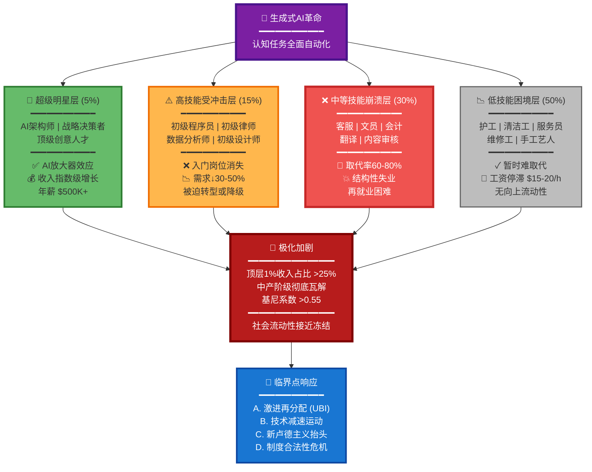
```mermaid
graph TB
    AI["🤖 生成式AI革命<br/>━━━━━━━━━━━━<br/>认知任务全面自动化"]
    
    L1["🌟 超级明星层 (5%)<br/>━━━━━━━━━━━━<br/>AI架构师 | 战略决策者<br/>顶级创意人才<br/>━━━━━━━━━━━━<br/>✅ AI放大器效应<br/>💰 收入指数级增长<br/>年薪 $500K+"]
    
    L2["⚠️ 高技能受冲击层 (15%)<br/>━━━━━━━━━━━━<br/>初级程序员 | 初级律师<br/>数据分析师 | 初级设计师<br/>━━━━━━━━━━━━<br/>❌ 入门岗位消失<br/>📉 需求↓30-50%<br/>被迫转型或降级"]
    
    L3["❌ 中等技能崩溃层 (30%)<br/>━━━━━━━━━━━━<br/>客服 | 文员 | 会计<br/>翻译 | 内容审核<br/>━━━━━━━━━━━━<br/>🚨 取代率60-80%<br/>💥 结构性失业<br/>再就业困难"]
    
    L4["📉 低技能困境层 (50%)<br/>━━━━━━━━━━━━<br/>护工 | 清洁工 | 服务员<br/>维修工 | 手工艺人<br/>━━━━━━━━━━━━<br/>✓ 暂时难取代<br/>💸 工资停滞 $15-20/h<br/>无向上流动性"]
    
    Crisis["🚨 极化加剧<br/>━━━━━━━━━━━━━━━━<br/>顶层1%收入占比 >25%<br/>中产阶级彻底瓦解<br/>基尼系数 >0.55<br/>━━━━━━━━━━━━━━━━<br/>社会流动性接近冻结"]
    
    Paths["🔀 临界点响应<br/>━━━━━━━━━━━━<br/>A. 激进再分配 (UBI)<br/>B. 技术减速运动<br/>C. 新卢德主义抬头<br/>D. 制度合法性危机"]
    
    AI --> L1
    AI --> L2
    AI --> L3
    AI --> L4
    
    L1 --> Crisis
    L2 --> Crisis
    L3 --> Crisis
    L4 --> Crisis
    
    Crisis --> Paths
    
    style AI fill:#7b1fa2,stroke:#4a148c,stroke-width:4px,color:#fff
    style L1 fill:#66bb6a,stroke:#2e7d32,stroke-width:3px
    style L2 fill:#ffb74d,stroke:#ef6c00,stroke-width:3px
    style L3 fill:#ef5350,stroke:#c62828,stroke-width:4px,color:#fff
    style L4 fill:#bdbdbd,stroke:#616161,stroke-width:2px
    style Crisis fill:#b71c1c,stroke:#7f0000,stroke-width:4px,color:#fff
    style Paths fill:#1976d2,stroke:#0d47a1,stroke-width:3px,color:#fff

```

**实证初步迹象** (2023-2025)：

- GitHub Copilot 使程序员生产力提升 55%，但初级开发岗位需求下降。
- 法律 AI 工具（如 Harvey）使初级律师文档审查工作减少 30-40%。
- Klarna 报告其 AI 客服处理了 2/3 的客户咨询，相当于 700 名全职员工。

### 3.3 技术变革速度的指数级加速

技术变革的速度首次超越了人类社会所有核心制度（教育、法律、政治）的调整能力。
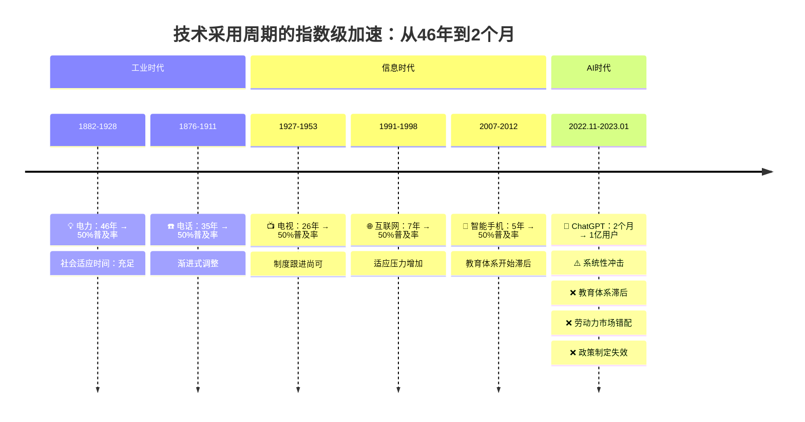
```mermaid
timeline
    title 技术采用周期的指数级加速：从46年到2个月
    
    section 工业时代
        1882-1928 : 💡 电力：46年 → 50%普及率
                  : 社会适应时间：充足
        1876-1911 : ☎️ 电话：35年 → 50%普及率
                  : 渐进式调整
    
    section 信息时代
        1927-1953 : 📺 电视：26年 → 50%普及率
                  : 制度跟进尚可
        1991-1998 : 🌐 互联网：7年 → 50%普及率
                  : 适应压力增加
        2007-2012 : 📱 智能手机：5年 → 50%普及率
                  : 教育体系开始滞后
    
    section AI时代
        2022.11-2023.01 : 🤖 ChatGPT：2个月 → 1亿用户
                        : ⚠️ 系统性冲击
                        : ❌ 教育体系滞后
                        : ❌ 劳动力市场错配
                        : ❌ 政策制定失效

```

> *当技术变革速度超过人类学习和制度调整的速度时，社会将进入**永久性适应危机**状态。这不是暂时的过渡期，而是新常态。*

---

## 四、技术陷阱的根源：制度失灵的连锁反应

### 4.1 谬误："技术进步必然带来繁荣"

技术进步不是自动的,它需要**制度激励结构**的支撑。历史反复证明:当权者、社会结构和经济模式共同决定了技术能否被采纳和扩散。

**前工业时代的理性抵制**
数千年来,统治者普遍将社会稳定置于经济效率之上:

- **罗马皇帝维斯帕先**(公元1世纪):拒绝使用能高效运输重型石柱的新机器
> "我如何养活我的人民?"

- **英国女王伊丽莎白一世**(1589年):拒绝为革命性针织机授予专利
> "这会让无数手工编织者陷入贫困,最终变为乞丐"

这些决策并非愚昧,而是在当时制度环境下的理性选择——**社会稳定 > 经济效率**。

**罗马帝国的技术停滞之谜**

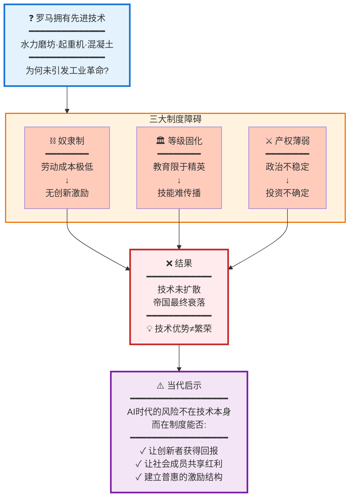
```mermaid
graph TB

Question["❓ 罗马拥有先进技术<br/>━━━━━━━━━━━━━━<br/>水力磨坊·起重机·混凝土<br/>━━━━━━━━━━━━━━<br/>为何未引发工业革命?"]

subgraph barriers["三大制度障碍"]

B1["⛓️ 奴隶制<br/>━━━━━━━━<br/>劳动成本极低<br/>↓<br/>无创新激励"]

B2["🏛️ 等级固化<br/>━━━━━━━━<br/>教育限于精英<br/>↓<br/>技能难传播"]

B3["⚔️ 产权薄弱<br/>━━━━━━━━<br/>政治不稳定<br/>↓<br/>投资不确定"]

end

Result["❌ 结果<br/>━━━━━━━━━━━━<br/>技术未扩散<br/>帝国最终衰落<br/>━━━━━━━━━━━━<br/>💡 技术优势≠繁荣"]

Lesson["⚠️ 当代启示<br/>━━━━━━━━━━━━━━━━━━<br/>AI时代的风险不在技术本身<br/>而在制度能否:<br/>━━━━━━━━━━━━━━━━━━<br/>✓ 让创新者获得回报<br/>✓ 让社会成员共享红利<br/>✓ 建立普惠的激励结构"]

Question --> barriers

B1 & B2 & B3 --> Result

Result --> Lesson

style Question fill:#e3f2fd,stroke:#1976d2,stroke-width:3px

style barriers fill:#fff3e0,stroke:#ef6c00,stroke-width:2px

style B1 fill:#ffccbc

style B2 fill:#ffccbc

style B3 fill:#ffccbc

style Result fill:#ffebee,stroke:#c62828,stroke-width:3px

style Lesson fill:#f3e5f5,stroke:#7b1fa2,stroke-width:3px
```

罗马拥有技术,但缺乏三个关键要素:

1. **创新激励**:奴隶制使劳动力成本极低,无人愿投资省力技术
2. **知识传播**:教育垄断于精英阶层,技能无法在社会扩散
3. **产权保障**:政治动荡导致投资回报不确定,抑制长期创新

> *无论是古代的奴隶制，还是当代的某些政策，只要制度环境无法让创新者和广大社会成员共享技术红利，技术进步的引擎就可能熄火。当代的 AI 风险，或许不在于技术本身，而在于我们是否能建立起促进创新普惠的制度环境。*

#### 陷阱的两种形态

- **停滞陷阱（Stagnation Trap）**：为了维持既有秩序而压制技术扩散，短期稳定但长期贫困。  
- **不平等陷阱（Inequality Trap）**：技术被广泛采用，但红利高度集中，最终演化为增长与撕裂并存。  

两者都可能把社会推向“低信任、低流动、低增长”的锁定状态，只是路径不同：前者是“技术上不去”，后者是“社会接不住”。

### 4.2 技术陷阱的政治经济学

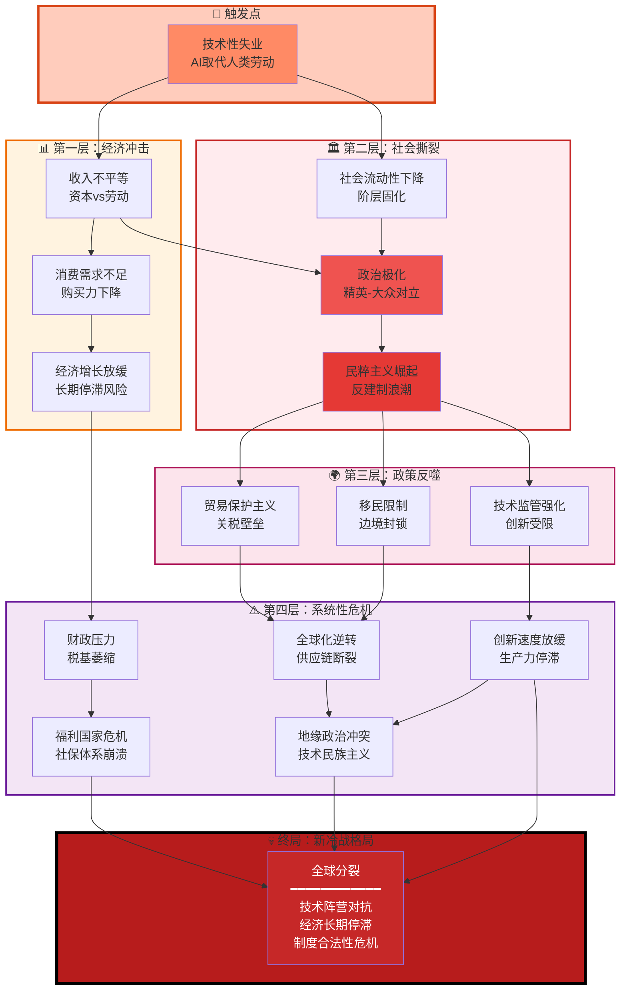
```mermaid
graph TB
    subgraph trigger["🎯 触发点"]
        A["技术性失业<br/>AI取代人类劳动"]
    end
    
    subgraph layer1["📊 第一层：经济冲击"]
        B["收入不平等<br/>资本vs劳动"]
        C["消费需求不足<br/>购买力下降"]
        D["经济增长放缓<br/>长期停滞风险"]
    end
    
    subgraph layer2["🏛️ 第二层：社会撕裂"]
        E["社会流动性下降<br/>阶层固化"]
        F["政治极化<br/>精英-大众对立"]
        G["民粹主义崛起<br/>反建制浪潮"]
    end
    
    subgraph layer3["🌍 第三层：政策反噬"]
        H["贸易保护主义<br/>关税壁垒"]
        I["移民限制<br/>边境封锁"]
        J["技术监管强化<br/>创新受限"]
    end
    
    subgraph layer4["⚠️ 第四层：系统性危机"]
        K["全球化逆转<br/>供应链断裂"]
        L["创新速度放缓<br/>生产力停滞"]
        M["地缘政治冲突<br/>技术民族主义"]
        O["财政压力<br/>税基萎缩"]
        P["福利国家危机<br/>社保体系崩溃"]
    end
    
    subgraph endgame["💀 终局：新冷战格局"]
        Q["全球分裂<br/>━━━━━━━━━━━━<br/>技术阵营对抗<br/>经济长期停滞<br/>制度合法性危机"]
    end
    
    A --> B
    A --> E
    B --> C
    B --> F
    C --> D
    E --> F
    F --> G
    G --> H
    G --> I
    G --> J
    H --> K
    I --> K
    J --> L
    D --> O
    O --> P
    K --> M
    L --> M
    M --> Q
    P --> Q
    L --> Q
    
    style trigger fill:#ffccbc,stroke:#d84315,stroke-width:3px
    style layer1 fill:#fff3e0,stroke:#ef6c00,stroke-width:2px
    style layer2 fill:#ffebee,stroke:#c62828,stroke-width:2px
    style layer3 fill:#fce4ec,stroke:#ad1457,stroke-width:2px
    style layer4 fill:#f3e5f5,stroke:#6a1b9a,stroke-width:2px
    style endgame fill:#b71c1c,stroke:#000,stroke-width:4px
    style A fill:#ff8a65
    style F fill:#ef5350
    style G fill:#e53935
    style Q fill:#c62828,color:#fff

```

**系统性风险**：技术陷阱不仅是劳动力市场问题，而是触发多米诺骨牌效应：

1. **经济维度**：需求侧萎缩 → 长期停滞
2. **政治维度**：精英-大众撕裂 → 制度失灵
3. **地缘维度**：技术民族主义 → 全球分裂

**历史类比**：1870-1914年的"第一次全球化"因技术冲击引发的社会矛盾，最终导致两次世界大战。当前（2020s）的相似性令人警醒。

#### 经济短路：福特悖论的当代表达

> “如果我不给工人高工资，谁来买我的车？”

这句话揭示了技术社会的宏观闭环：**生产、分配、消费**必须同步。  
当制度无法把技术红利转化为劳动者购买力时，系统会发生“经济短路”：

1. **生产端**：AI 与自动化推动供给能力快速上升。  
2. **分配端**：工资份额下降、资本份额上升，收入向头部集中。  
3. **消费端**：中位数家庭购买力不足，无法消化新增产能。  

结果不是“造不出”，而是“买不起”。这也是技术繁荣与社会焦虑并存的根本原因。

### 4.3 历史周期律的深层机制

技术冲击并不直接生成新秩序，它会先生成压力，再触发改革。  
可观测变量只有三组：

1. **政治响应性**：能否在利益冲突中形成可执行改革。  
2. **教育适配性**：能否把新技能供给速度拉到接近技术扩散速度。  
3. **安全网强度**：能否把转型期失业从“生存危机”降为“迁移成本”。  

历史上真正突破陷阱的时刻，通常由三种力量共同触发：精英让步、危机催化、互补技术成熟。

---

## 五、未来10年技术发展趋势与社会影响预测

### 5.1 三种可能的未来情景

未来不是单一路径，而是三种制度响应模型的竞争。

#### 路径比较

| 路径 | 核心机制 | 主要优势 | 主要风险 |
| --- | --- | --- | --- |
| 北欧模式 | 高税收 + 强再分配 + 再培训 | 社会凝聚、转型缓冲强 | 税基被 AI 侵蚀，复制门槛高 |
| 美国模式 | 最小干预 + 市场主导 | 创新速度快 | 不平等放大，政治极化加剧 |
| 欧陆模式 | 防御性监管 + 就业保护 | 社会稳定性高 | 创新外流与相对增长放缓 |

### 5.2 基于历史规律的制度推演

参照工业革命后的制度创新（1850-1920），当代可能出现的制度响应：

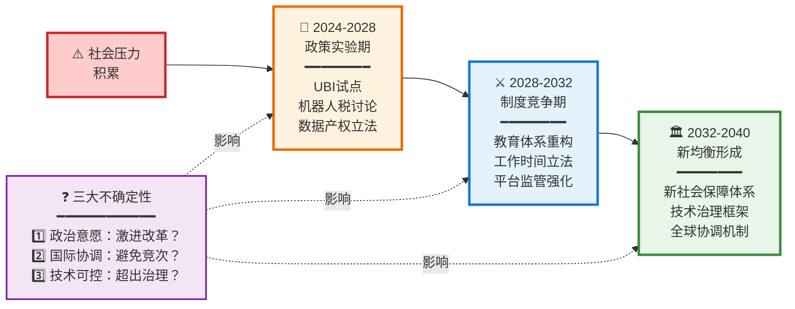
```mermaid
graph LR
    Start["⚠️ 社会压力<br/>积累"] --> P["🧪 2024-2028<br/>政策实验期<br/>━━━━━━━━<br/>UBI试点<br/>机器人税讨论<br/>数据产权立法"]
    
    P --> C["⚔️ 2028-2032<br/>制度竞争期<br/>━━━━━━━━<br/>教育体系重构<br/>工作时间立法<br/>平台监管强化"]
    
    C --> D["🏛️ 2032-2040<br/>新均衡形成<br/>━━━━━━━━<br/>新社会保障体系<br/>技术治理框架<br/>全球协调机制"]
    
    U["❓ 三大不确定性<br/>━━━━━━━━━━━━<br/>1️⃣ 政治意愿：激进改革？<br/>2️⃣ 国际协调：避免竞次？<br/>3️⃣ 技术可控：超出治理？"]
    
    U -.影响.-> P
    U -.影响.-> C
    U -.影响.-> D
    
    style Start fill:#ffcccc,stroke:#c92a2a,stroke-width:3px
    style P fill:#fff3e0,stroke:#ef6c00,stroke-width:3px
    style C fill:#e3f2fd,stroke:#1976d2,stroke-width:3px
    style D fill:#e8f5e9,stroke:#388e3c,stroke-width:3px
    style U fill:#f3e5f5,stroke:#7b1fa2,stroke-width:2px

```

**关键不确定性**：
1. **政治意愿**：是否有足够的政治资本推动激进改革？
2. **国际协调**：能否避免"监管竞次"（race to the bottom）？
3. **技术可控性**：AI 发展是否会超出人类治理能力？

### 5.3 关键技术领域的具体预测

#### 5.3.1 生成式AI的劳动力市场冲击

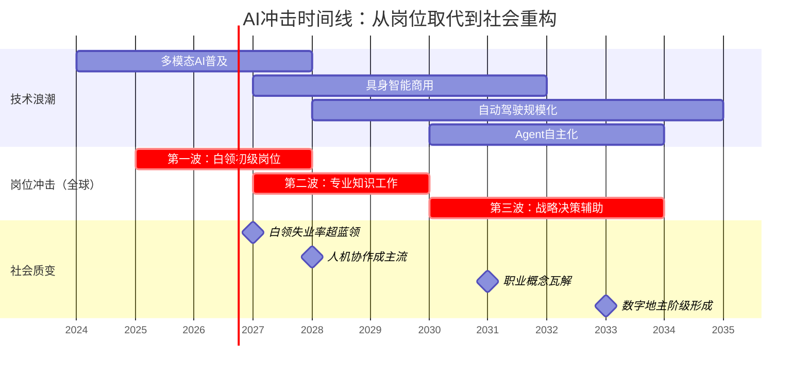
```mermaid
gantt
    title AI冲击时间线：从岗位取代到社会重构
    dateFormat YYYY
    axisFormat %Y
    
    section 技术浪潮
    多模态AI普及           :2024, 2028
    具身智能商用           :2027, 2032
    自动驾驶规模化         :2028, 2035
    Agent自主化           :2030, 2034
    
    section 岗位冲击（全球）
    第一波：白领初级岗位 :crit, 2025, 2028
    第二波：专业知识工作 :crit, 2027, 2030
    第三波：战略决策辅助 :crit, 2030, 2034
    
    section 社会质变
    白领失业率超蓝领       :milestone, 2027, 0d
    人机协作成主流         :milestone, 2028, 0d
    职业概念瓦解           :milestone, 2031, 0d
    数字地主阶级形成       :milestone, 2033, 0d

```

| 阶段        | 时间        | 关键特征                                   | 社会分化                              |
| --------- | --------- | -------------------------------------- | --------------------------------- |
| **第一波冲击** | 2024-2027 | 多模态AI冲击白领   客服、创作、初级编程减少30-50%      | 白领失业率首超蓝领   新增岗位仅相当于被取代岗位的10%        |
| **第二波冲击** | 2027-2030 | 法律、医疗、金融等   专业工作部分自动化               | 知识工作者分化   顶尖10%收入暴涨   中位数下降 |
| **第三波冲击** | 2030-2034 | Agent自主化、职业→任务市场   管理决策、战略规划 AI 辅助化 | 数字地主阶级形成   AI基础设施控制权集中         |

#### 5.3.2 机器人技术的物理世界渗透

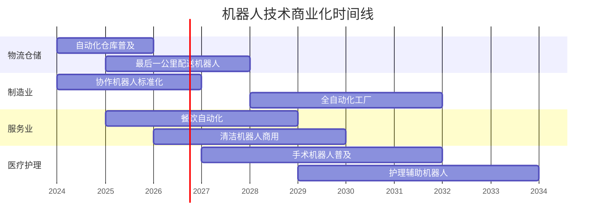
```mermaid
gantt  
    title 机器人技术商业化时间线  
    dateFormat YYYY  
    axisFormat %Y
    section 物流仓储  
    自动化仓库普及 :2024, 2026  
    最后一公里配送机器人 :2025, 2028  
    section 制造业  
    协作机器人标准化 :2024, 2027  
    全自动化工厂 :2028, 2032  
    section 服务业  
    餐饮自动化 :2025, 2029  
    清洁机器人商用 :2026, 2030  
    section 医疗护理  
    手术机器人普及 :2027, 2032  
    护理辅助机器人 :2029, 2034
```

**社会影响预测**：

- 2030年前，全球制造业就业减少20-30%
- 发展中国家"制造业立国"路径被阻断
- 地缘政治格局重塑：技术领先国家与技术依赖国家的鸿沟扩大

#### 5.3.3 关键技术领域影响评估

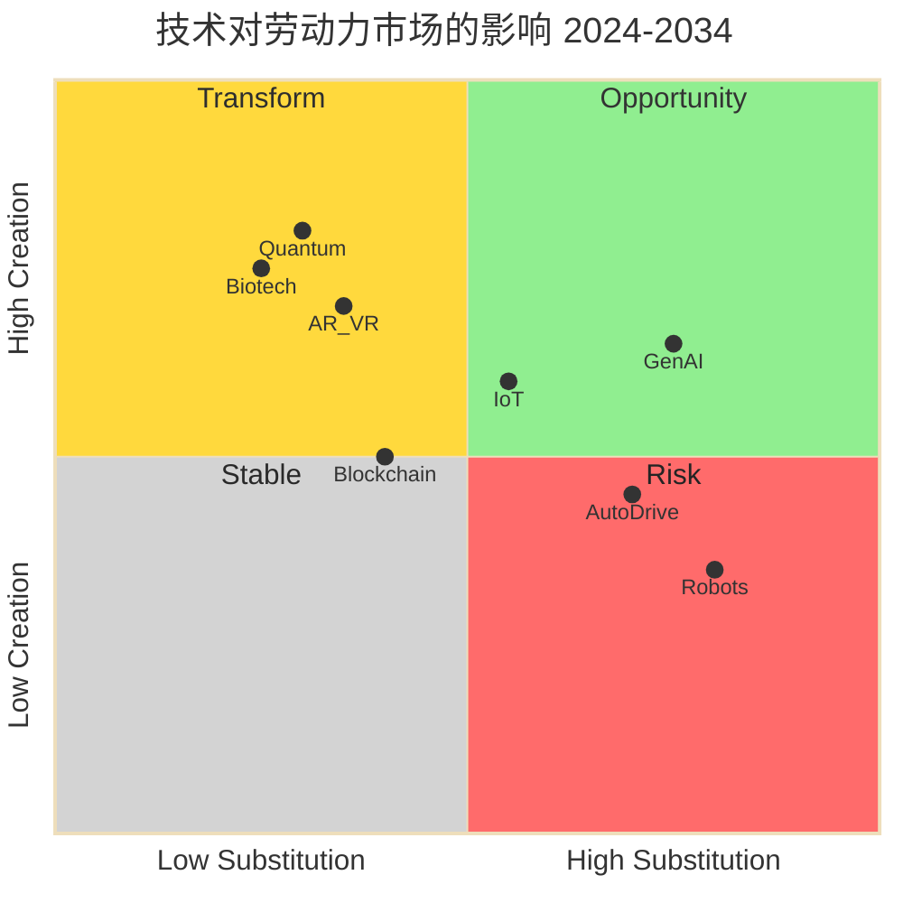
```mermaid
%%{init: {'theme':'base', 'themeVariables': { 'quadrant1Fill':'#90ee90', 'quadrant2Fill':'#ffd93d', 'quadrant3Fill':'#d3d3d3', 'quadrant4Fill':'#ff6b6b'}}}%%
quadrantChart
    title 技术对劳动力市场的影响 2024-2034
    x-axis Low Substitution --> High Substitution
    y-axis Low Creation --> High Creation
    quadrant-1 Opportunity
    quadrant-2 Transform
    quadrant-3 Stable
    quadrant-4 Risk
  
    GenAI: [0.75, 0.65]
    AutoDrive: [0.70, 0.45]
    Robots: [0.80, 0.35]
    Quantum: [0.30, 0.80]
    Biotech: [0.25, 0.75]
    Blockchain: [0.40, 0.50]
    AR_VR: [0.35, 0.70]
    IoT: [0.55, 0.60]

```

**图表说明**：
- **风险区**（高取代/低创造）：工业机器人、自动驾驶——需要重点政策干预
- **机遇区**（高取代/高创造）：生成式 AI——破坏与创造并存，需引导转型
- **转型区**（低取代/高创造）：量子计算、生物技术——未来高技能就业增长点

#### 5.3.4 技术发展的三大确定性趋势

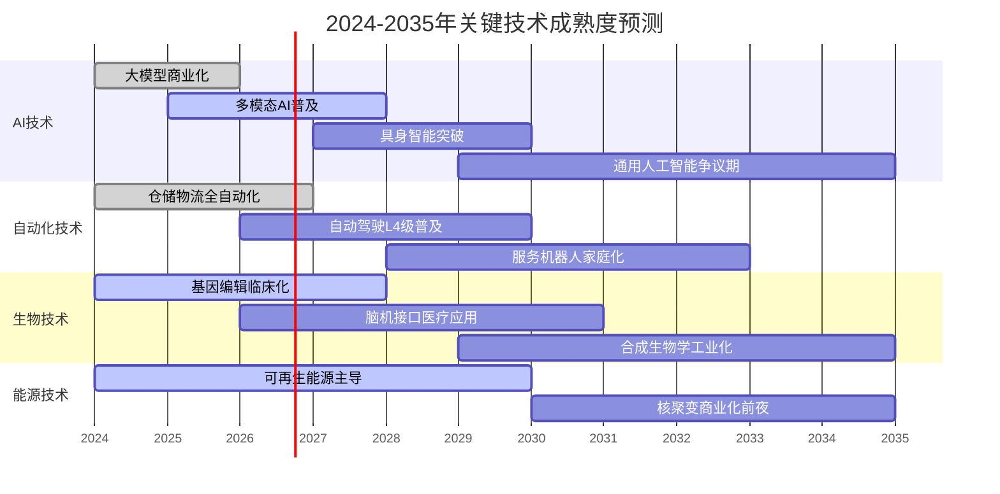
```mermaid
gantt
    title 2024-2035年关键技术成熟度预测
    dateFormat YYYY
    axisFormat %Y
    
    section AI技术
    大模型商业化     :done, 2024, 2026
    多模态AI普及        :active, 2025, 2028
    具身智能突破        :2027, 2030
    通用人工智能争议期   :2029, 2035
    
    section 自动化技术
    仓储物流全自动化    :done, 2024, 2027
    自动驾驶L4级普及    :2026, 2030
    服务机器人家庭化    :2028, 2033
    
    section 生物技术
    基因编辑临床化      :active, 2024, 2028
    脑机接口医疗应用    :2026, 2031
    合成生物学工业化    :2029, 2035
    
    section 能源技术
    可再生能源主导      :active, 2024, 2030
    核聚变商业化前夜    :2030, 2035

```

**趋势1：认知自动化的深化**
- 2024-2027：专业知识工作的部分自动化（法律、医疗、金融）
- 2027-2030：创意工作的协作自动化（设计、内容创作）
- 2030-2035：战略决策的辅助自动化（管理、政策制定）

**趋势2：物理自动化的突破**
- 关键技术：具身智能+ 灵巧操作
- 影响领域：制造业、农业、建筑业、家政服务
- 社会影响：最后的"低技能避风港"消失

**趋势3：生物-数字融合**
- 脑机接口：医疗康复 → 能力增强
- 基因编辑：疾病治疗 → 人类增强
- **伦理挑战：阶级差距演变为"生物学分层"**

> *这些数字背后是数十亿个家庭的生计、尊严与希望。历史告诉我们，技术进步的"长期收益"对于在转型期失业的个体而言毫无意义——**一个人的职业生涯只有40年，等不起80年的制度调整周期**。*

---

## 六、战略性应对框架：个人、组织与国家层面

### 6.1 技术成熟度的历史镜像

#### 6.1.1 纽科门蒸汽机（1712）vs 当代大语言模型

**历史的惊人重演**：革命性技术在早期阶段的共同特征

| 技术瓶颈维度    | 纽科门蒸汽机                 | 催生的历史职业                 | 当代 LLM            | 催生的当代职业                     |
| --------- | ---------------------- | ----------------------- | ----------------- | --------------------------- |
| **可靠性瓶颈** | 热效率<1% 燃料严重浪费      | • 蒸汽机效率优化师 • 热力学研究员 | AI 幻觉 输出不可靠   | • 提示词工程师 • 模型对齐专家       |
| **易用性瓶颈** | 仅能用于煤矿抽水 无法推广到其他行业 | • 机械适配工程师 • 应用场景设计师 | 需复杂工程化 才能落地应用 | • AI 微调工程师 • LLMOps 工程师 |
| **经济性瓶颈** | 造价和维护费用极高 只有大矿主能用  | • 精密车床发明家 • 成本优化专家  | 算力成本巨大 推理费用高昂 | • 模型压缩专家 • 推理优化工程师      |

> ***核心定律**：**技术的瓶颈定义了人的价值**。当前AI的不完美性，恰恰创造了大量"修补技术短板"的高价值岗位。*

#### 6.1.2 福特流水线（1913）vs AI认知流水线（2025-）

**从体力解构到认知解构**

| 对比维度     | 福特流水线      | AI认知流水线        |
| -------- | ---------- | -------------- |
| **解构对象** | 体力劳动（造车）   | 认知劳动（分析、创作、决策） |
| **核心机制** | 任务标准化+分工   | 任务模块化+AI协作     |
| **智慧转移** | 工匠大脑→流水线设计 | 知识工作者→系统架构     |
| **人类角色** | 执行者→监督者    | 执行者→定义者+评估者    |

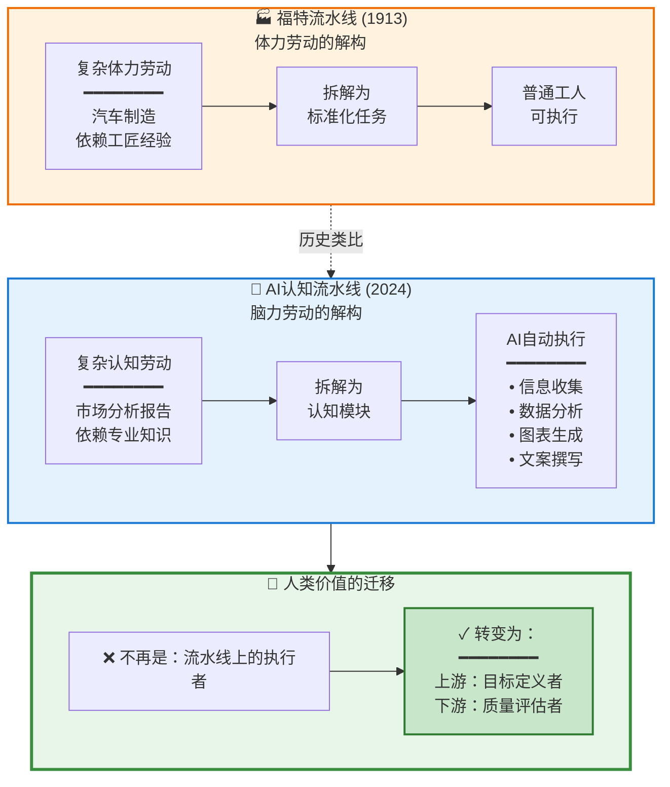
```mermaid
graph TB
    subgraph ford["🏭 福特流水线 (1913)<br/>体力劳动的解构"]
        F1["复杂体力劳动<br/>━━━━━━━━<br/>汽车制造<br/>依赖工匠经验"]
        F2["拆解为<br/>标准化任务"]
        F3["普通工人<br/>可执行"]
        F1 --> F2 --> F3
    end
  
    subgraph ai["🤖 AI认知流水线 (2024)<br/>脑力劳动的解构"]
        A1["复杂认知劳动<br/>━━━━━━━━<br/>市场分析报告<br/>依赖专业知识"]
        A2["拆解为<br/>认知模块"]
        A3["AI自动执行<br/>━━━━━━━━<br/>• 信息收集<br/>• 数据分析<br/>• 图表生成<br/>• 文案撰写"]
        A1 --> A2 --> A3
    end
  
    subgraph shift["🔄 人类价值的迁移"]
        V1["❌ 不再是：流水线上的执行者"]
        V2["✓ 转变为：<br/>━━━━━━━━<br/>上游：目标定义者<br/>下游：质量评估者"]
        V1 --> V2
    end
  
    ford -.历史类比.-> ai
    ai --> shift
  
    style ford fill:#fff3e0,stroke:#ef6c00,stroke-width:2px
    style ai fill:#e3f2fd,stroke:#1976d2,stroke-width:2px
    style shift fill:#e8f5e9,stroke:#388e3c,stroke-width:3px
    style V2 fill:#c8e6c9,stroke:#2e7d32,stroke-width:2px

```

**核心类比**：
- **福特做的事**：把制造汽车这种依赖老师傅的工作，拆解成简单标准化任务
- **AI 做的事**：把写报告、做分析这种依赖知识工作者的任务，拆解成可自动化的子任务

**关键差异**：
- 福特解构的是**体力劳动** → 工人从工匠变成流水线工人（价值下降）
- AI 解构的是**认知劳动** → 知识工作者从执行者变成架构师（价值可能上升）

**为什么这次不同**：
在体力流水线时代，工人失去了对整个生产过程的掌控。但在认知流水线时代，如果你能掌握**编排能力**，你反而获得了对更大系统的掌控权——从做一件事，到设计一个能自动做一百件事的系统。

> *一条看不见的**认知流水线**正在成型，在这条认知流水线上人类的价值发生了根本性的迁移，我们不再是流水线上的某个执行环节，而是转移到流水线的上游和下游。上游定义目标，告诉流水线要做什么，下游评估产出，确保它符合我们的战略意图，简单来说就是从执行者变成定义者和评估者*

#### 6.1.3 技术成熟度曲线

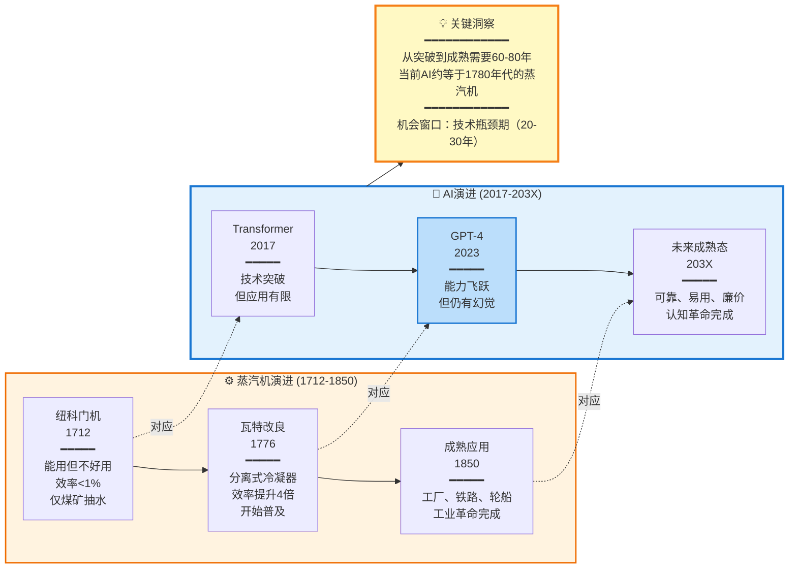
```mermaid
graph LR
    subgraph steam["⚙️ 蒸汽机演进 (1712-1850)"]
        N["纽科门机<br/>1712<br/>━━━━━<br/>能用但不好用<br/>效率<1%<br/>仅煤矿抽水"] 
        W["瓦特改良<br/>1776<br/>━━━━━<br/>分离式冷凝器<br/>效率提升4倍<br/>开始普及"]
        M["成熟应用<br/>1850<br/>━━━━━<br/>工厂、铁路、轮船<br/>工业革命完成"]
    end
  
    subgraph ai["🤖 AI演进 (2017-203X)"]
        T["Transformer<br/>2017<br/>━━━━━<br/>技术突破<br/>但应用有限"]
        G["GPT-4<br/>2023<br/>━━━━━<br/>能力飞跃<br/>但仍有幻觉"]
        F["未来成熟态<br/>203X<br/>━━━━━<br/>可靠、易用、廉价<br/>认知革命完成"]
    end
  
    N --> W --> M
    T --> G --> F
  
    Insight["💡 关键洞察<br/>━━━━━━━━━━━━<br/>从突破到成熟需要60-80年<br/>当前AI约等于1780年代的蒸汽机<br/>━━━━━━━━━━━━<br/>机会窗口：技术瓶颈期（20-30年）"]
  
    N -.对应.-> T
    W -.对应.-> G
    M -.对应.-> F
  
    ai --> Insight
  
    style steam fill:#fff3e0,stroke:#ef6c00,stroke-width:2px
    style ai fill:#e3f2fd,stroke:#1976d2,stroke-width:3px
    style Insight fill:#fff9c4,stroke:#f57f17,stroke-width:3px
    style G fill:#bbdefb,stroke:#1976d2,stroke-width:2px

```

**时间线对照**：

- 纽科门机（1712）→ 瓦特改良（1776）= **64年**
- Transformer（2017）→ GPT-4（2023）= **6年**（速度快10倍）

**当前位置判断**： 我们大约处于"1780年代"——技术已经突破，但距离完全成熟还有20-30年。这个阶段是**黄金机会窗口**，因为：

1. 技术足够强大，可以创造价值
2. 技术仍有瓶颈，需要人类互补
3. 竞争格局未定，个人有机会建立优势

### 6.2 个人层面：构建"反脆弱"职业能力

总纲：从“岗位安全感”转向“能力组合优势”。在 AI 时代，真正稳定的不是职位名称，而是你定义问题、编排工具、承担判断责任的能力。

#### 可执行框架：四层个人策略

1. **战略定位：错位竞争（锯齿状前沿）**  
在 AI 强项（规模化模式识别）之外，优先布局非结构化问题、现实场景交互、跨学科缝合任务。  

2. **工作流重构：半人马模式**  
从“亲自做每一步”转向“编排多智能体协作”，把人从执行者迁移为任务定义者与质量评估者。  

3. **核心壁垒：从求解到提问**  
当答案生成成本趋近于零，稀缺品转为“好问题、好判断、好品味”；人类价值体现在筛选与取舍。  

4. **情感价值：高科技 + 高触感**  
在医疗、教育、咨询等高信任场景，深度共情与长期关系仍是难以被机器取代的竞争优势。  

### 6.3 组织层面：重新定义价值创造

组织失败通常不是因为“技术不够强”，而是把 AI 当成一次性降本项目。  
组织转型要点：

1. **工作再设计**：按“机器做重复、人做判断”重排流程与岗位。  
2. **学习机制内建**：把技能升级做成持续系统，而非短期培训活动。  
3. **治理同步上线**：在人机协作、责任边界、风险审计上建立可执行规则。  

### 6.4 国家层面：新型社会契约的构建

基于《技术陷阱》的历史教训，成功的国家战略需要同时解决**效率**与**公平**：

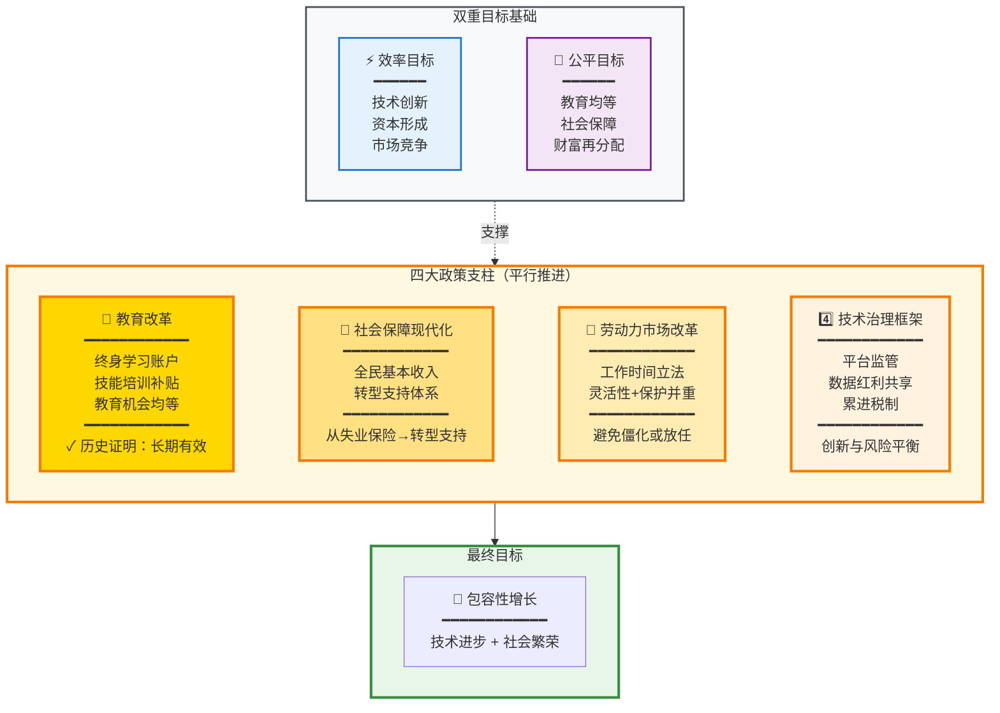
```mermaid
graph TB
    subgraph foundation["双重目标基础"]
        F1["⚡ 效率目标<br/>━━━━━━<br/>技术创新<br/>资本形成<br/>市场竞争"]
        F2["🤝 公平目标<br/>━━━━━━<br/>教育均等<br/>社会保障<br/>财富再分配"]
        F1 ~~~ F2
    end
    
    subgraph pillars["四大政策支柱（平行推进）"]
        P1["🥇 教育改革<br/>━━━━━━━━━━━━<br/>终身学习账户<br/>技能培训补贴<br/>教育机会均等<br/>━━━━━━━━━━━━<br/>✓ 历史证明：长期有效"]
        P2["🥈 社会保障现代化<br/>━━━━━━━━━━━━<br/>全民基本收入<br/>转型支持体系<br/>━━━━━━━━━━━━<br/>从失业保险→转型支持"]
        P3["🥉 劳动力市场改革<br/>━━━━━━━━━━━━<br/>工作时间立法<br/>灵活性+保护并重<br/>━━━━━━━━━━━━<br/>避免僵化或放任"]
        P4["4️⃣ 技术治理框架<br/>━━━━━━━━━━━━<br/>平台监管<br/>数据红利共享<br/>累进税制<br/>━━━━━━━━━━━━<br/>创新与风险平衡"]
        P1 ~~~ P2 ~~~ P3 ~~~ P4
    end
    
    subgraph result["最终目标"]
        R["🌟 包容性增长<br/>━━━━━━━━━━━━<br/>技术进步 + 社会繁荣"]
    end
    
    foundation -.支撑.-> pillars
    pillars --> result
    
    style foundation fill:#f8f9fa,stroke:#495057,stroke-width:2px
    style F1 fill:#e3f2fd,stroke:#1976d2,stroke-width:2px
    style F2 fill:#f3e5f5,stroke:#7b1fa2,stroke-width:2px
    
    style pillars fill:#fff8e1,stroke:#f57c00,stroke-width:3px
    style P1 fill:#ffd700,stroke:#f57c00,stroke-width:3px
    style P2 fill:#ffe082,stroke:#f57c00,stroke-width:3px
    style P3 fill:#ffecb3,stroke:#f57c00,stroke-width:3px
    style P4 fill:#fff3e0,stroke:#f57c00,stroke-width:3px
    
    style result fill:#e8f5e9,stroke:#388e3c,stroke-width:3px

```

**政策优先级排序**（基于历史有效性）：
1. **教育改革**（最高优先级）：历史证明这是唯一长期有效的解决方案
2. **社会保障现代化**：从"失业保险"转向"转型支持"
3. **劳动力市场灵活性与保护的平衡**：避免过度僵化或过度放任
4. **技术治理框架**：在创新与风险之间建立动态平衡

---

## 七、深层哲学反思：技术与人类命运

### 7.1 "技术决定论"的谬误

技术不是主体，人类选择才是。以下是其哲学含义：

1. **分配规则来自制度而非算法**：技术只能提供能力边界，无法自行定义公平边界。  
2. **效率不是唯一目标**：若把“可计算”误当“应当做”，社会将以公平、尊严和意义为代价。  
3. **进步不是自动积累，而是治理成果**：技术能力增长并不等于文明质量提升，二者之间需要制度与伦理桥接。  

**核心论断**：反对技术决定论，不是反技术，而是把技术重新置于公共选择与责任框架之中。

### 7.2 工作的意义危机

当AI能够完成越来越多的认知任务时，人类面临的不仅是经济问题，更是**存在主义危机**：
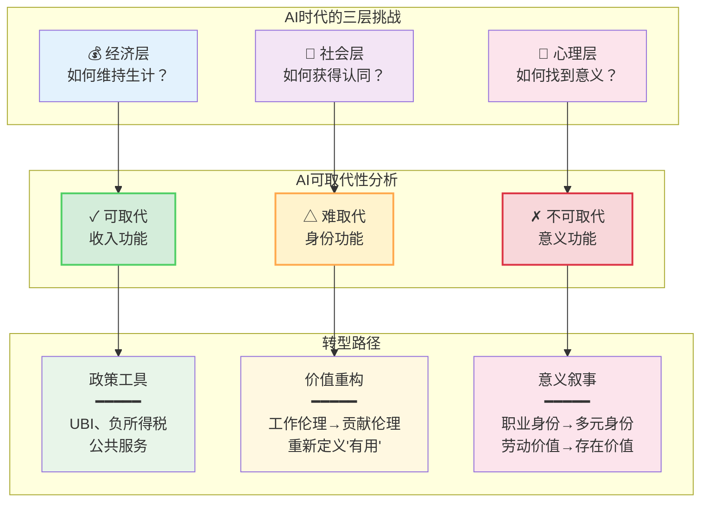
```mermaid
graph TB
    subgraph challenge["AI时代的三层挑战"]
        C1["💰 经济层<br/>如何维持生计？"]
        C2["👥 社会层<br/>如何获得认同？"]
        C3["🎯 心理层<br/>如何找到意义？"]
    end
    
    subgraph replaceable["AI可取代性分析"]
        R1["✓ 可取代<br/>收入功能"]
        R2["△ 难取代<br/>身份功能"]
        R3["✗ 不可取代<br/>意义功能"]
    end
    
    subgraph solution["转型路径"]
        S1["政策工具<br/>━━━━━<br/>UBI、负所得税<br/>公共服务"]
        S2["价值重构<br/>━━━━━<br/>工作伦理→贡献伦理<br/>重新定义'有用'"]
        S3["意义叙事<br/>━━━━━<br/>职业身份→多元身份<br/>劳动价值→存在价值"]
    end
    
    C1 --> R1 --> S1
    C2 --> R2 --> S2
    C3 --> R3 --> S3
    
    style C1 fill:#e3f2fd
    style C2 fill:#f3e5f5
    style C3 fill:#fce4ec
    style R1 fill:#d4edda,stroke:#51cf66,stroke-width:2px
    style R2 fill:#fff3cd,stroke:#ffa94d,stroke-width:2px
    style R3 fill:#f8d7da,stroke:#dc3545,stroke-width:2px
    style S1 fill:#e8f5e9
    style S2 fill:#fff8e1
    style S3 fill:#fce4ec

```

---

## 八、结论：走出技术陷阱的历史使命

### 8.1 当代的独特挑战

与工业革命相比，AI时代面临三个更严峻的挑战：

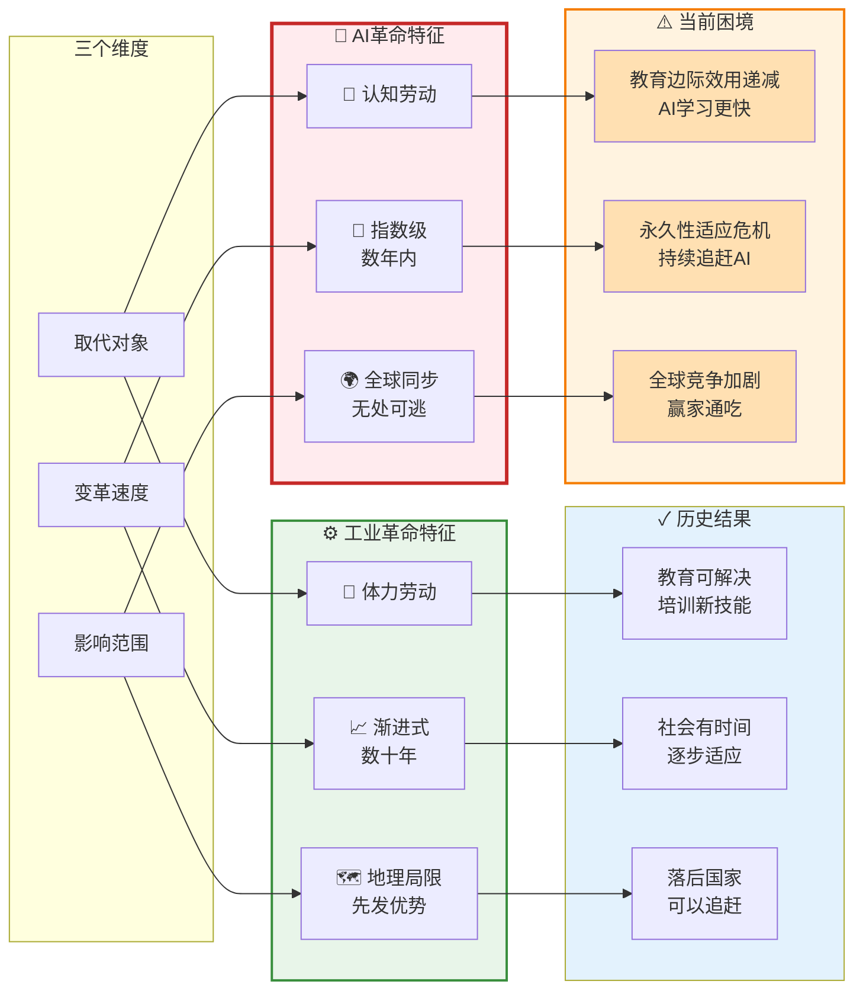
```mermaid
graph LR
    
    subgraph dimension["三个维度"]
        D1["取代对象"]
        D2["变革速度"]
        D3["影响范围"]
    end
    
    subgraph industrial["⚙️ 工业革命特征"]
        I1["💪 体力劳动"]
        I2["📈 渐进式<br/>数十年"]
        I3["🗺️ 地理局限<br/>先发优势"]
    end
    
    subgraph ai["🤖 AI革命特征"]
        A1["🧠 认知劳动"]
        A2["🚀 指数级<br/>数年内"]
        A3["🌍 全球同步<br/>无处可逃"]
    end
    
    subgraph outcome_old["✓ 历史结果"]
        O1["教育可解决<br/>培训新技能"]
        O2["社会有时间<br/>逐步适应"]
        O3["落后国家<br/>可以追赶"]
    end
    
    subgraph outcome_new["⚠️ 当前困境"]
        N1["教育边际效用递减<br/>AI学习更快"]
        N2["永久性适应危机<br/>持续追赶AI"]
        N3["全球竞争加剧<br/>赢家通吃"]
    end
    
    D1 --> I1 & A1
    D2 --> I2 & A2
    D3 --> I3 & A3
    
    I1 --> O1
    I2 --> O2
    I3 --> O3
    
    A1 --> N1
    A2 --> N2
    A3 --> N3
    
    style industrial fill:#e8f5e9,stroke:#388e3c,stroke-width:2px
    style ai fill:#ffebee,stroke:#c62828,stroke-width:3px
    style outcome_old fill:#e3f2fd
    style outcome_new fill:#fff3e0,stroke:#f57c00,stroke-width:2px
    style N1 fill:#ffe0b2
    style N2 fill:#ffe0b2
    style N3 fill:#ffe0b2

```

### 8.2 行动纲领：多层次协同应对

这一代人需要重写 AI 时代的社会契约：  
增长不能再以“效率先赢、分配后补”的顺序运行，技术治理必须与技术扩散同步推进。  

对当权者的要求是：把教育、再培训和转型保障前置到冲击发生之前，而不是失业发生之后。  
对组织的要求是：把 AI 视为能力放大器而非裁员工具，把生产率增益转化为人才资本。  
对个体的要求是：从执行型职业身份转向定义与判断型能力身份，在不确定性中保持迁移能力。  

### 8.3 最终洞察：历史的教训与希望

《技术陷阱》传递的核心信息既是警告也是希望：

**警告**：如果我们重复工业革命早期的错误——放任市场自发调节、忽视社会成本、延迟制度改革——那么未来几十年将充满动荡和苦难。

**希望**：人类已经有过成功应对技术革命的经验。19世纪末到20世纪中叶的制度创新（义务教育、社会保障、劳工权利）最终实现了技术进步与社会繁荣的双赢。

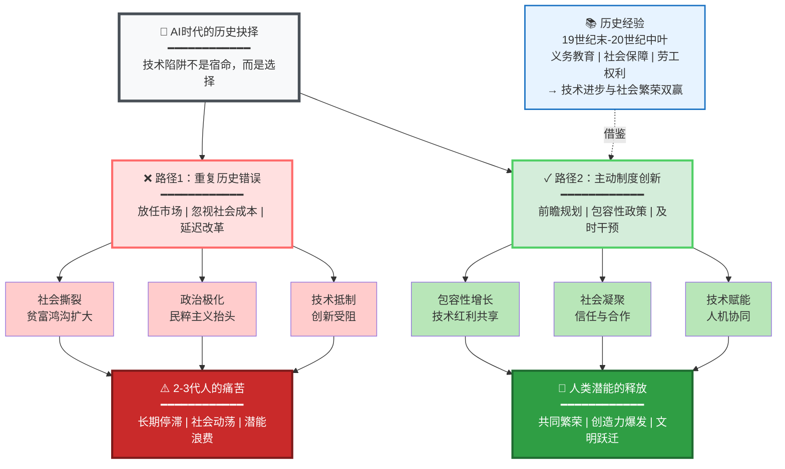
```mermaid
graph TB
    Start["🔱 AI时代的历史抉择<br/>━━━━━━━━━━━━<br/>技术陷阱不是宿命，而是选择"]
    
    Start --> Path1["❌ 路径1：重复历史错误<br/>━━━━━━━━━━━━<br/>放任市场 | 忽视社会成本 | 延迟改革"]
    Start --> Path2["✓ 路径2：主动制度创新<br/>━━━━━━━━━━━━<br/>前瞻规划 | 包容性政策 | 及时干预"]
    
    Path1 --> Bad1["社会撕裂<br/>贫富鸿沟扩大"]
    Path1 --> Bad2["政治极化<br/>民粹主义抬头"]
    Path1 --> Bad3["技术抵制<br/>创新受阻"]
    
    Bad1 & Bad2 & Bad3 --> Doom["⚠️ 2-3代人的痛苦<br/>━━━━━━━━━━━━<br/>长期停滞 | 社会动荡 | 潜能浪费"]
    
    Path2 --> Good1["包容性增长<br/>技术红利共享"]
    Path2 --> Good2["社会凝聚<br/>信任与合作"]
    Path2 --> Good3["技术赋能<br/>人机协同"]
    
    Good1 & Good2 & Good3 --> Hope["🌟 人类潜能的释放<br/>━━━━━━━━━━━━<br/>共同繁荣 | 创造力爆发 | 文明跃迁"]
    
    History["📚 历史经验<br/>19世纪末-20世纪中叶<br/>义务教育 | 社会保障 | 劳工权利<br/>→ 技术进步与社会繁荣双赢"]
    
    History -.借鉴.-> Path2
    
    style Start fill:#f8f9fa,stroke:#495057,stroke-width:4px
    style Path1 fill:#ffe0e0,stroke:#ff6b6b,stroke-width:3px
    style Path2 fill:#d4edda,stroke:#51cf66,stroke-width:3px
    style Bad1 fill:#ffcccc
    style Bad2 fill:#ffcccc
    style Bad3 fill:#ffcccc
    style Good1 fill:#b8e6b8
    style Good2 fill:#b8e6b8
    style Good3 fill:#b8e6b8
    style Doom fill:#c92a2a,stroke:#7d1a1a,stroke-width:3px,color:#fff
    style Hope fill:#2f9e44,stroke:#1e6b30,stroke-width:3px,color:#fff
    style History fill:#e7f3ff,stroke:#1971c2,stroke-width:2px

```

> ***最终结论**：技术陷阱不是宿命，而是选择。我们这一代人的历史使命，是在技术加速变革的时代，建立起能够让所有人受益的制度框架。这需要勇气、智慧和集体行动——但历史证明，这是可能的。*
